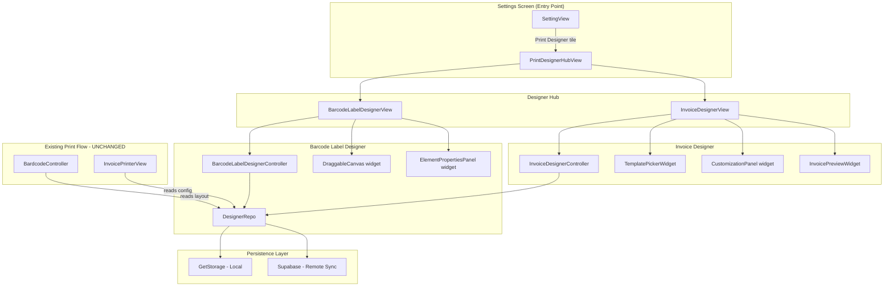
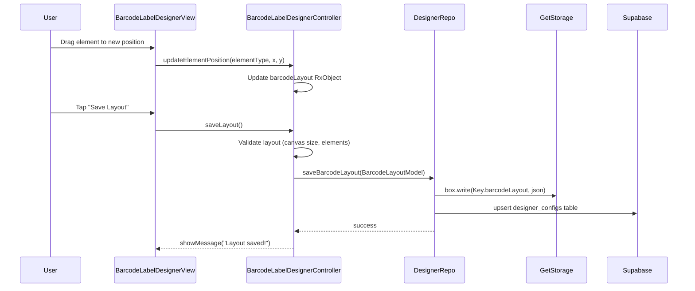
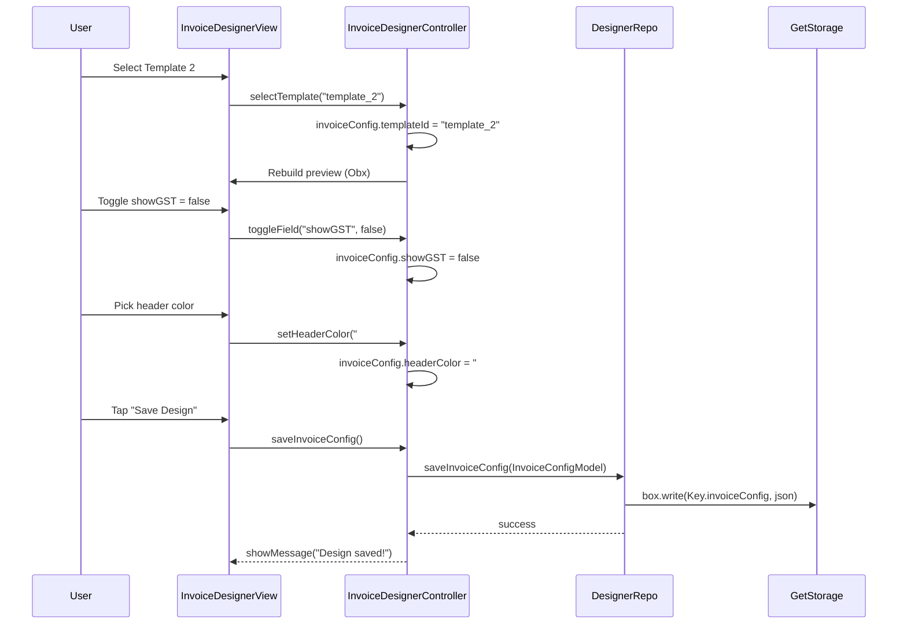
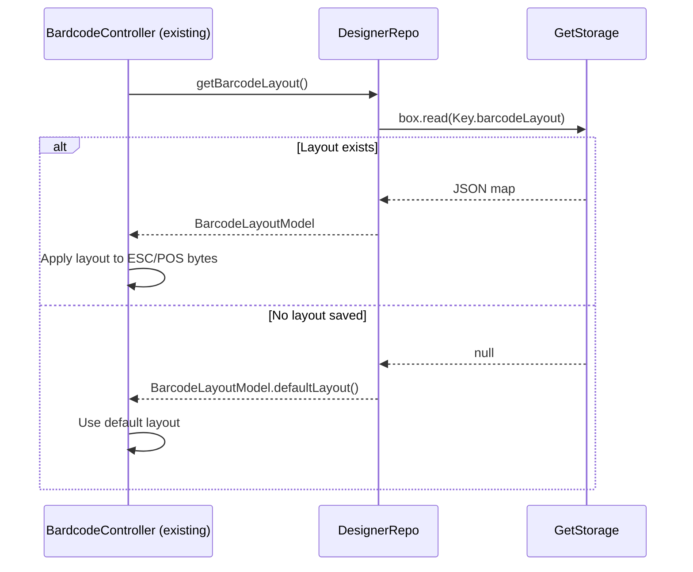

# Design Document: Invoice + Barcode Label Designer

## Overview

HisabBox ke shop owners ke liye ek visual designer feature jo unhe apne barcode labels aur invoices ko customize karne deta hai. Barcode designer mein drag-and-drop canvas hai jahan elements (barcode, product name, price, weight) ko position kiya ja sakta hai, aur invoice designer mein pre-made templates ke saath per-template customization (font size, field visibility, header color, footer text) milti hai. Dono designs JSON format mein locally (GetStorage) aur Supabase pe sync hote hain taaki cross-device consistency rahe.

Yeh feature existing `BardcodeController`, `InvoicePrinterView`, aur `BarcodePrinterView` ke print flows ko **bilkul touch nahi karta** — sirf ek naya design layer add karta hai jo print ke waqt use hota hai.

---

## Architecture



---

## Sequence Diagrams

### Barcode Label Designer — Save Flow



### Invoice Designer — Template Select & Save Flow



### Print Flow — Reading Saved Design



---

## Components and Interfaces

### Component 1: DesignerRepo

**Purpose**: Single source of truth for reading/writing designer configs. Existing `CacheManager` pattern ko extend karta hai.

**Interface**:
```dart
abstract class DesignerRepo {
  Future<void> saveBarcodeLayout(BarcodeLayoutModel layout);
  Future<BarcodeLayoutModel> getBarcodeLayout();
  Future<void> saveInvoiceConfig(InvoiceConfigModel config);
  Future<InvoiceConfigModel> getInvoiceConfig();
  Future<void> syncToSupabase(String userId, Map<String, dynamic> data);
}
```

**Responsibilities**:
- GetStorage mein JSON serialize/deserialize karna
- Supabase `designer_configs` table mein upsert karna
- Default fallback values provide karna jab koi saved config na ho

---

### Component 2: BarcodeLabelDesignerController

**Purpose**: Barcode canvas state manage karna — element positions, canvas size, save/load.

**Interface**:
```dart
class BarcodeLabelDesignerController extends GetxController with CacheManager {
  Rx<BarcodeLayoutModel> barcodeLayout;
  RxBool isSaving;
  RxBool isLoading;

  void updateElementPosition(String elementType, double x, double y);
  void updateElementFontSize(String elementType, double fontSize);
  void setCanvasSize(CanvasSize size);  // mm58 or mm80
  Future<void> saveLayout();
  Future<void> loadLayout();
  void resetToDefault();
}
```

**Responsibilities**:
- Canvas pe element drag events handle karna
- Layout validation (elements canvas bounds ke andar hain)
- DesignerRepo ke through persist karna

---

### Component 3: InvoiceDesignerController

**Purpose**: Invoice template selection aur per-template customization state manage karna.

**Interface**:
```dart
class InvoiceDesignerController extends GetxController with CacheManager {
  Rx<InvoiceConfigModel> invoiceConfig;
  RxBool isSaving;
  RxBool isLoading;
  RxList<InvoiceTemplate> availableTemplates;

  void selectTemplate(String templateId);
  void setFontSize(FontSizeOption size);
  void toggleField(String fieldKey, bool value);
  void setHeaderColor(String hexColor);
  void setFooterText(String text);
  Future<void> saveInvoiceConfig();
  Future<void> loadInvoiceConfig();
}
```

**Responsibilities**:
- Template selection aur live preview update
- Field visibility toggles (showLogo, showGST, showAddress, etc.)
- Color picker integration
- DesignerRepo ke through persist karna

---

### Component 4: DraggableCanvas

**Purpose**: 58mm/80mm thermal paper canvas ka visual representation jahan elements drag-and-drop ho sakein.

**Interface**:
```dart
class DraggableCanvas extends StatelessWidget {
  final BarcodeLayoutModel layout;
  final Function(String elementType, double x, double y) onElementMoved;
  final Function(String elementType) onElementSelected;
  final String? selectedElementType;
}
```

**Responsibilities**:
- Canvas ko mm se pixels mein scale karna (58mm → ~219px at 96dpi)
- Har element ko `Positioned` + `GestureDetector` se wrap karna
- Selected element ko highlight karna
- Bounds checking — element canvas se bahar na jaye

---

### Component 5: ElementPropertiesPanel

**Purpose**: Selected element ki properties (font size, visibility) edit karne ka panel.

**Interface**:
```dart
class ElementPropertiesPanel extends StatelessWidget {
  final BarcodeElement? selectedElement;
  final Function(double fontSize) onFontSizeChanged;
  final Function(bool visible) onVisibilityChanged;
}
```

---

### Component 6: InvoicePreviewWidget

**Purpose**: Current invoice config ke saath live preview render karna.

**Interface**:
```dart
class InvoicePreviewWidget extends StatelessWidget {
  final InvoiceConfigModel config;
  final InvoiceTemplate template;
}
```

---

## Data Models

### BarcodeLayoutModel

```dart
class BarcodeLayoutModel {
  final CanvasSize canvasSize;       // mm58 (58mm) or mm80 (80mm)
  final double canvasWidth;          // mm mein
  final double canvasHeight;         // mm mein
  final List<BarcodeElement> elements;

  const BarcodeLayoutModel({
    required this.canvasSize,
    required this.canvasWidth,
    required this.canvasHeight,
    required this.elements,
  });

  factory BarcodeLayoutModel.defaultLayout() => BarcodeLayoutModel(
    canvasSize: CanvasSize.mm58,
    canvasWidth: 58,
    canvasHeight: 30,
    elements: [
      BarcodeElement(type: ElementType.barcode, x: 10, y: 5, width: 120, height: 40),
      BarcodeElement(type: ElementType.productName, x: 10, y: 50, fontSize: 12),
      BarcodeElement(type: ElementType.price, x: 80, y: 50, fontSize: 14),
    ],
  );

  Map<String, dynamic> toJson();
  factory BarcodeLayoutModel.fromJson(Map<String, dynamic> json);
}
```

**Validation Rules**:
- `canvasWidth` must be 58 or 80
- `canvasHeight` must be > 0 and ≤ 100
- Each element's `x + width` must not exceed `canvasWidth * scaleFactor`
- Each element's `y + height` must not exceed `canvasHeight * scaleFactor`

---

### BarcodeElement

```dart
class BarcodeElement {
  final ElementType type;   // barcode, productName, price, weight
  final double x;           // mm mein position
  final double y;           // mm mein position
  final double? width;      // barcode ke liye
  final double? height;     // barcode ke liye
  final double? fontSize;   // text elements ke liye
  final bool visible;

  Map<String, dynamic> toJson();
  factory BarcodeElement.fromJson(Map<String, dynamic> json);
}

enum ElementType { barcode, productName, price, weight }
enum CanvasSize { mm58, mm80 }
```

---

### InvoiceConfigModel

```dart
class InvoiceConfigModel {
  final String templateId;          // "template_1" .. "template_4"
  final FontSizeOption fontSize;    // small, medium, large
  final bool showLogo;
  final bool showGST;
  final bool showAddress;
  final bool showMobile;
  final String footerText;
  final String headerColor;         // always '#000000' (black) — fixed, not user-configurable

  const InvoiceConfigModel({
    this.templateId = 'template_1',
    this.fontSize = FontSizeOption.medium,
    this.showLogo = true,
    this.showGST = true,
    this.showAddress = true,
    this.showMobile = true,
    this.footerText = 'Thank you for shopping!',
    this.headerColor = '#000000',   // fixed black
  });

  Map<String, dynamic> toJson();
  factory InvoiceConfigModel.fromJson(Map<String, dynamic> json);
}

enum FontSizeOption { small, medium, large }
```

---

### InvoiceTemplate

```dart
class InvoiceTemplate {
  final String id;           // "template_1" .. "template_4"
  final String name;         // "Classic", "Modern", "Minimal", "Bold"
  final String previewAsset; // asset path for thumbnail
}
```

---

### Supabase Table: designer_configs

```sql
CREATE TABLE designer_configs (
  id          UUID PRIMARY KEY DEFAULT gen_random_uuid(),
  user_id     UUID NOT NULL REFERENCES auth.users(id),
  config_type TEXT NOT NULL,  -- 'barcode_layout' | 'invoice_config'
  config_data JSONB NOT NULL,
  updated_at  TIMESTAMPTZ DEFAULT now(),
  UNIQUE(user_id, config_type)
);
```

---

## Key Functions with Formal Specifications

### Function 1: `updateElementPosition()`

```dart
void updateElementPosition(String elementType, double x, double y)
```

**Preconditions:**
- `elementType` is a valid `ElementType` string value
- `x >= 0` and `y >= 0`
- `x <= canvasWidthPx` and `y <= canvasHeightPx`

**Postconditions:**
- The matching element in `barcodeLayout.elements` has updated `x` and `y`
- All other elements remain unchanged
- `barcodeLayout` Rx triggers a rebuild

**Loop Invariants:** N/A (single element lookup)

---

### Function 2: `saveLayout()`

```dart
Future<void> saveLayout()
```

**Preconditions:**
- `barcodeLayout` is non-null and has at least one element
- All elements are within canvas bounds

**Postconditions:**
- `isSaving` transitions: `false → true → false`
- On success: layout is persisted in GetStorage AND Supabase sync is attempted
- On Supabase failure: local save still succeeds (offline-first)
- User sees success/error snackbar

---

### Function 3: `getBarcodeLayout()`

```dart
Future<BarcodeLayoutModel> getBarcodeLayout()
```

**Preconditions:**
- GetStorage is initialized

**Postconditions:**
- Returns `BarcodeLayoutModel.fromJson(stored)` if stored data exists and is valid
- Returns `BarcodeLayoutModel.defaultLayout()` if no data or parse error
- Never throws — always returns a usable model

---

### Function 4: `toggleField()`

```dart
void toggleField(String fieldKey, bool value)
```

**Preconditions:**
- `fieldKey` is one of: `showLogo`, `showGST`, `showAddress`, `showMobile`

**Postconditions:**
- `invoiceConfig.fieldKey == value`
- Preview widget rebuilds via Obx
- No other fields are mutated

---

## Algorithmic Pseudocode

### Main Algorithm: Barcode Canvas Drag & Drop

```pascal
ALGORITHM handleElementDrag(elementType, dragDelta, currentLayout)
INPUT: elementType: String, dragDelta: Offset, currentLayout: BarcodeLayoutModel
OUTPUT: updatedLayout: BarcodeLayoutModel

BEGIN
  // Step 1: Find element
  element ← currentLayout.elements.firstWhere(e => e.type == elementType)
  
  IF element IS NULL THEN
    RETURN currentLayout  // no-op
  END IF
  
  // Step 2: Calculate new position (convert px delta to mm)
  scaleFactor ← canvasWidthPx / currentLayout.canvasWidth
  newX ← element.x + (dragDelta.dx / scaleFactor)
  newY ← element.y + (dragDelta.dy / scaleFactor)
  
  // Step 3: Clamp to canvas bounds
  newX ← MAX(0, MIN(newX, currentLayout.canvasWidth - elementWidthMm))
  newY ← MAX(0, MIN(newY, currentLayout.canvasHeight - elementHeightMm))
  
  ASSERT newX >= 0 AND newX <= currentLayout.canvasWidth
  ASSERT newY >= 0 AND newY <= currentLayout.canvasHeight
  
  // Step 4: Rebuild layout with updated element
  updatedElements ← currentLayout.elements.map(e =>
    IF e.type == elementType THEN e.copyWith(x: newX, y: newY)
    ELSE e
  )
  
  RETURN currentLayout.copyWith(elements: updatedElements)
END
```

**Preconditions:**
- `currentLayout` is valid and non-null
- `dragDelta` is a finite Offset (no NaN/Infinity)

**Postconditions:**
- Returned layout has exactly the same number of elements
- Only the target element's x/y changed
- All elements remain within canvas bounds

**Loop Invariants:**
- During `map`: all previously processed elements are valid and within bounds

---

### Algorithm: Save with Offline-First Strategy

```pascal
ALGORITHM saveDesignerConfig(configType, configData, repo)
INPUT: configType: String, configData: Map, repo: DesignerRepo
OUTPUT: success: bool

BEGIN
  // Step 1: Local save (always first)
  TRY
    repo.saveToGetStorage(configType, configData)
    localSaved ← true
  CATCH error
    RETURN false  // local save failed — critical error
  END TRY
  
  ASSERT localSaved = true
  
  // Step 2: Remote sync (best-effort, non-blocking)
  TRY
    userId ← retrieveUserDetail().data?.id
    IF userId IS NOT NULL THEN
      AWAIT repo.syncToSupabase(userId, {
        "config_type": configType,
        "config_data": configData
      })
    END IF
  CATCH networkError
    // Log but don't fail — offline-first
    AppLogger.info("Supabase sync failed: $networkError")
  END TRY
  
  RETURN true
END
```

**Preconditions:**
- `configData` is a valid JSON-serializable map
- `repo` is initialized

**Postconditions:**
- Local GetStorage always updated on success
- Supabase sync is attempted but failure does not block local save
- Returns `true` if local save succeeded

---

### Algorithm: Load Config with Fallback

```pascal
ALGORITHM loadDesignerConfig(configType, repo)
INPUT: configType: String ('barcode_layout' | 'invoice_config')
OUTPUT: config: BarcodeLayoutModel | InvoiceConfigModel

BEGIN
  // Step 1: Try local cache
  stored ← repo.readFromGetStorage(configType)
  
  IF stored IS NOT NULL THEN
    TRY
      config ← parseConfig(configType, stored)
      ASSERT config IS VALID
      RETURN config
    CATCH parseError
      AppLogger.info("Parse error, using default: $parseError")
    END TRY
  END IF
  
  // Step 2: Try Supabase (if online)
  TRY
    userId ← retrieveUserDetail().data?.id
    IF userId IS NOT NULL THEN
      remoteData ← AWAIT repo.fetchFromSupabase(userId, configType)
      IF remoteData IS NOT NULL THEN
        repo.saveToGetStorage(configType, remoteData)  // cache it
        RETURN parseConfig(configType, remoteData)
      END IF
    END IF
  CATCH networkError
    AppLogger.info("Remote fetch failed: $networkError")
  END TRY
  
  // Step 3: Default fallback
  RETURN defaultConfig(configType)
END
```

**Postconditions:**
- Always returns a usable config (never null, never throws)
- Local cache is updated when remote data is fetched

---

## Example Usage

### Barcode Designer — Controller Usage

```dart
// In BarcodeLabelDesignerController.onReady()
@override
void onReady() async {
  await loadLayout();  // loads from GetStorage or default
  super.onReady();
}

// User drags barcode element
void updateElementPosition(String elementType, double x, double y) {
  final updated = barcodeLayout.value.elements.map((e) {
    if (e.type.name == elementType) return e.copyWith(x: x, y: y);
    return e;
  }).toList();
  barcodeLayout.value = barcodeLayout.value.copyWith(elements: updated);
}

// Save button tapped
Future<void> saveLayout() async {
  isSaving.value = true;
  try {
    await _repo.saveBarcodeLayout(barcodeLayout.value);
    showMessage(message: 'Layout saved!');
  } catch (e) {
    showSnackBar(error: e.toString());
  } finally {
    isSaving.value = false;
  }
}
```

### Invoice Designer — Template Selection

```dart
// In InvoiceDesignerView
TemplatePickerWidget(
  templates: controller.availableTemplates,
  selectedId: controller.invoiceConfig.value.templateId,
  onSelected: (id) => controller.selectTemplate(id),
)

// In InvoiceDesignerController
void selectTemplate(String templateId) {
  invoiceConfig.value = invoiceConfig.value.copyWith(templateId: templateId);
  // Obx in view auto-rebuilds preview
}
```

### Reading Layout in Existing Print Flow

```dart
// In BardcodeController.buildLabelBytes() — ADDITIVE CHANGE ONLY
Future<List<int>> buildLabelBytes({
  required String barcodeNo,
  required int quantity,
}) async {
  // NEW: Load saved layout (falls back to default if none saved)
  final layout = await DesignerRepo().getBarcodeLayout();
  
  // Existing logic continues, now using layout.elements for positioning
  // ...existing ESC/POS byte generation...
}
```

---

## Correctness Properties

*A property is a characteristic or behavior that should hold true across all valid executions of a system — essentially, a formal statement about what the system should do. Properties serve as the bridge between human-readable specifications and machine-verifiable correctness guarantees.*

### Property 1: BarcodeLayoutModel Serialization Round-Trip

*For any* valid `BarcodeLayoutModel` instance (any canvas size, any number of elements with any valid positions and font sizes), serializing it with `toJson()` and then deserializing with `fromJson()` SHALL produce an equivalent instance with identical field values.

**Validates: Requirements 6.1, 6.3**

---

### Property 2: InvoiceConfigModel Serialization Round-Trip

*For any* valid `InvoiceConfigModel` instance (any template id, any font size option, any combination of field visibility flags, any valid header color, any footer text), serializing it with `toJson()` and then deserializing with `fromJson()` SHALL produce an equivalent instance with identical field values.

**Validates: Requirements 6.2, 6.3**

---

### Property 3: Canvas Bounds Clamping Invariant

*For any* `BarcodeLayoutModel` and *for any* drag delta applied to any `BarcodeElement`, the resulting element position SHALL satisfy `e.x >= 0`, `e.x + e.effectiveWidth <= canvasWidth`, `e.y >= 0`, and `e.y + e.effectiveHeight <= canvasHeight`. No drag operation can place an element outside the canvas boundaries.

**Validates: Requirements 2.3**

---

### Property 4: Element Font Size Isolation

*For any* `BarcodeLayoutModel` and *for any* target element type and font size value, calling `updateElementFontSize(elementType, fontSize)` SHALL update only the matching element's `fontSize` field; all other elements in the layout SHALL remain byte-for-byte identical to their pre-call state.

**Validates: Requirements 2.4**

---

### Property 5: Barcode Layout Save Round-Trip

*For any* valid `BarcodeLayoutModel`, calling `saveLayout()` followed by `getBarcodeLayout()` SHALL return an equivalent model with identical canvas size, canvas dimensions, and element list.

**Validates: Requirements 3.1, 7.2**

---

### Property 6: Invoice Config Save Round-Trip

*For any* valid `InvoiceConfigModel`, calling `saveInvoiceConfig()` followed by `getInvoiceConfig()` SHALL return an equivalent model with identical template id, font size, field visibility flags, header color, and footer text.

**Validates: Requirements 5.1, 7.2**

---

### Property 7: Default Fallback Guarantee

*For any* state of GetStorage (empty, containing valid data, or containing corrupted/malformed data) and *for any* state of network connectivity, both `DesignerRepo.getBarcodeLayout()` and `DesignerRepo.getInvoiceConfig()` SHALL return a non-null, structurally valid model and SHALL never throw an exception.

**Validates: Requirements 7.2, 7.3, 7.5, 2.1, 3.1**

---

### Property 8: Offline-First Save Guarantee

*For any* valid designer config and *for any* network state (online, offline, or Supabase returning an error), a call to `saveLayout()` or `saveInvoiceConfig()` SHALL persist the config to GetStorage and return success, regardless of whether the Supabase sync succeeds or fails.

**Validates: Requirements 3.4, 3.5, 5.4, 5.5**

---

### Property 9: Idempotent Save

*For any* valid `BarcodeLayoutModel` or `InvoiceConfigModel`, calling the corresponding save function twice in succession with the same model SHALL produce identical stored state in GetStorage after both calls — the second call SHALL NOT corrupt, duplicate, or alter the stored data.

**Validates: Requirements 3.6, 5.6**

---

### Property 10: Template Selection Isolation

*For any* `InvoiceConfigModel` and *for any* valid template id, calling `selectTemplate(templateId)` SHALL update only `invoiceConfig.templateId`; all other fields (fontSize, showLogo, showGST, showAddress, showMobile, footerText, headerColor) SHALL remain unchanged.

**Validates: Requirements 4.3**

---

### Property 11: Field Visibility Isolation

*For any* `InvoiceConfigModel` and *for any* field key in `{showLogo, showGST, showAddress, showMobile}` and *for any* boolean value, calling `toggleField(fieldKey, value)` SHALL update only the targeted field; all other fields of InvoiceConfigModel SHALL remain unchanged.

**Validates: Requirements 4.4**

---

### Property 12: Valid Hex Color Accepted

*For any* string that matches the pattern `^#[0-9A-Fa-f]{6}$`, calling `setHeaderColor(hexString)` SHALL update `invoiceConfig.headerColor` to that string.

**Validates: Requirements 4.6**

---

### Property 13: Invalid Hex Color Rejected

*For any* string that does NOT match the pattern `^#[0-9A-Fa-f]{6}$`, calling `setHeaderColor(hexString)` SHALL leave `invoiceConfig.headerColor` unchanged and equal to its pre-call value.

**Validates: Requirements 4.7**

---

## Error Handling

### Error Scenario 1: Supabase Sync Failure

**Condition**: Network unavailable or Supabase returns error during `syncToSupabase()`
**Response**: Log error via `AppLogger.info()`, show no error to user (sync is best-effort)
**Recovery**: Next successful save will sync. On app restart, `loadDesignerConfig()` tries Supabase again.

---

### Error Scenario 2: Corrupted GetStorage Data

**Condition**: Stored JSON is malformed (e.g., app crash during write)
**Response**: `fromJson()` throws → caught in `loadDesignerConfig()` → falls back to `defaultLayout()`
**Recovery**: User sees default layout. Next save overwrites corrupted data.

---

### Error Scenario 3: Element Dragged Out of Bounds

**Condition**: User drags element beyond canvas edges
**Response**: `updateElementPosition()` clamps x/y to valid range — element snaps to nearest valid position
**Recovery**: Immediate — no error state, canvas always valid

---

### Error Scenario 4: Invalid Color Hex Input

**Condition**: Color picker returns invalid hex string
**Response**: `setHeaderColor()` validates with regex `^#[0-9A-Fa-f]{6}$` — rejects invalid values, keeps previous color
**Recovery**: User sees no change, previous color retained

---

## Testing Strategy

### Unit Testing Approach

- `BarcodeLayoutModel.fromJson()` / `toJson()` round-trip tests
- `InvoiceConfigModel.fromJson()` / `toJson()` round-trip tests
- `updateElementPosition()` — bounds clamping tests
- `toggleField()` — only target field changes
- `defaultLayout()` — returns valid model with all required elements

### Property-Based Testing Approach

**Property Test Library**: `dart_test` with custom generators (or `fast_check` if added)

Key properties to test:
- For any valid `BarcodeLayoutModel`, `fromJson(toJson(model)) == model` (serialization round-trip)
- For any drag delta, resulting element position is always within `[0, canvasWidth]` × `[0, canvasHeight]`
- `saveLayout()` followed by `getBarcodeLayout()` returns equivalent model

### Integration Testing Approach

- `DesignerRepo` integration: save → read → verify equality
- Supabase sync: mock network, verify local save still succeeds on network error
- Existing print flow regression: `BardcodeController.buildLabelBytes()` with no saved layout produces same bytes as before feature addition

---

## Performance Considerations

- Canvas drag events use `GestureDetector.onPanUpdate` — updates are batched via `Obx` reactive rebuild, not `setState` per frame
- `DraggableCanvas` uses `RepaintBoundary` to isolate canvas repaints from the rest of the screen
- Supabase sync is fire-and-forget (`unawaited`) — does not block UI
- `InvoicePreviewWidget` is rebuilt only when `invoiceConfig` Rx changes (GetX fine-grained reactivity)
- JSON serialization is synchronous and lightweight (< 1KB per config) — no isolate needed

---

## Security Considerations

- `designer_configs` Supabase table uses Row Level Security (RLS): `user_id = auth.uid()` — users can only read/write their own configs
- No sensitive data (passwords, tokens) stored in designer configs
- `headerColor` input is validated against hex regex before storage to prevent injection

---

## Dependencies

### Existing (Already in pubspec.yaml — No New Packages)
- `get: ^4.7.2` — GetX state management, routing
- `get_storage` — local persistence (already used in `CacheManager`)
- `supabase_flutter` — remote sync (already integrated)
- `flutter_screenutil` — responsive sizing
- `flutter_bluetooth_printer` + `esc_pos_utils_plus` — existing print flow (unchanged)

### New Flutter Packages Required
- None — `flutter_colorpicker` is not needed since header color is fixed black (`#000000`)

### No New Architecture Patterns
- Follows existing `GetX MVC + Repository` pattern
- Follows existing `module_name/binding|controller|model|repo|view|widget/` folder structure
- Reuses `CacheManager` mixin pattern for GetStorage access
- Reuses `AppRoutes.navigateRoutes()` + `AppRouteName` pattern for navigation

---

## Module Folder Structure

```
lib/module/invoice_barcode_designer/
├── binding/
│   ├── barcode_label_designer_binding.dart
│   └── invoice_designer_binding.dart
├── controller/
│   ├── barcode_label_designer_controller.dart
│   └── invoice_designer_controller.dart
├── model/
│   ├── barcode_layout_model.dart
│   ├── barcode_element_model.dart
│   └── invoice_config_model.dart
├── repo/
│   └── designer_repo.dart
├── view/
│   ├── print_designer_hub_view.dart
│   ├── barcode_label_designer_view.dart
│   └── invoice_designer_view.dart
└── widget/
    ├── draggable_canvas.dart
    ├── element_properties_panel.dart
    ├── template_picker_widget.dart
    ├── customization_panel.dart
    └── invoice_preview_widget.dart
```

---

## Route Additions

```dart
// route_name.dart mein add karna
static const String printDesignerHub = '/printDesignerHub';
static const String barcodeLabelDesigner = '/barcodeLabelDesigner';
static const String invoiceDesigner = '/invoiceDesigner';
```

```dart
// routes.dart mein add karna
GetPage(
  name: AppRouteName.printDesignerHub,
  page: () => PrintDesignerHubView(),
  binding: PrintDesignerHubBinding(),
),
GetPage(
  name: AppRouteName.barcodeLabelDesigner,
  page: () => BarcodeLabelDesignerView(),
  binding: BarcodeLabelDesignerBinding(),
),
GetPage(
  name: AppRouteName.invoiceDesigner,
  page: () => InvoiceDesignerView(),
  binding: InvoiceDesignerBinding(),
),
```

---

## Settings Screen Integration

`SettingView` mein "Print" section ke andar ek naya `_SettingTile` add hoga:

```dart
// setting.dart — "App" section ke baad naya "Print" section
_SectionLabel(label: 'Print'),
setHeight(height: 8),
_SettingsGroup(
  items: [
    _SettingTile(
      icon: Icons.design_services_rounded,
      iconColor: const Color(0xFF00838F),
      label: 'Print Designer',
      subtitle: 'Customize barcode labels & invoices',
      onTap: () => AppRoutes.navigateRoutes(
        routeName: AppRouteName.printDesignerHub,
      ),
      isLast: true,
    ),
  ],
),
```

---

## CacheManager Key Additions

```dart
// cache_manager.dart — Key enum mein add karna
enum Key {
  // ...existing keys...
  barcodeLayout,    // BarcodeLayoutModel JSON
  invoiceConfig,    // InvoiceConfigModel JSON
}
```
